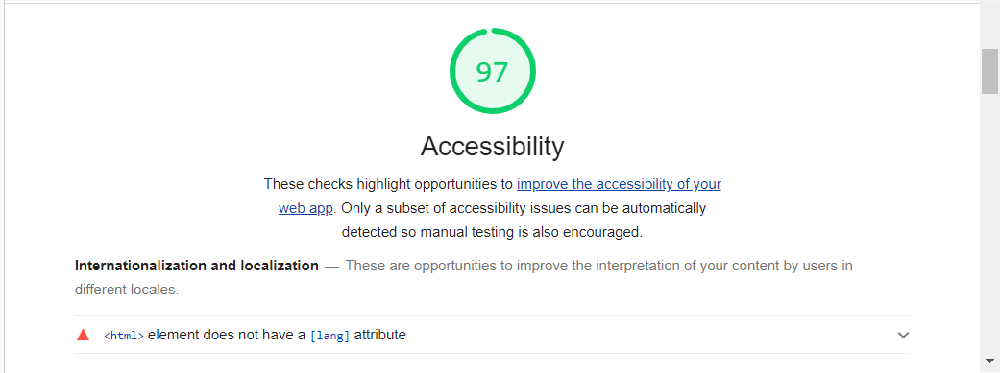

# Find A Worker

Find A Worker is a website with two different main functions:

Worker's function, where a skilled user can create a work publication. User that is looking for a worker can check the publications and get the worker's contact details.

https://milestone04.herokuapp.com/

## Author

Arthur Henrique El Mezaonik Martins

## Table of Contents

- [Find A Worker](#find-a-worker)

  * [Author](#author)

  * [Table of Contents](#table-of-contents)

  * [How to Use](#how-to-use)

  * [Features](#features)

    + [Implemented Features](#implemented-features)

      - [Worker](#worker)

      - [User](#user)

    + [Future Features](#future-features)

  * [ERD](#erd)

  * [Testing](#testing)

    + [Validation Testing](#validation-testing)

    + [Manual Testing](#manual-testing)

    + [Bugs](#bugs)

    + [Unifxed Bugs](#unifxed-bugs)

  * [Agile](#agile)

    + [User Stories](#user-stories)

    + [Kanban Board](#kanban-board)

  * [Deployment](#deployment)

    + [Creating App.](#creating-app)

    + [Setting up database](#setting-up-database)

    + [Setting up Heroku App](#setting-up-heroku-app)

    + [App Deployment](#app-deployment)

  * [Credits](#credits)

    + [Acknowledgments](#acknowledgments)

    + [Media](#media)

<small><i><a href='http://ecotrust-canada.github.io/markdown-toc/'>Table of contents generated with markdown-toc</a></i></small>

## How to Use

*__Worker:__*

To be a worker, the first thing you need to do is register an account on the webiste.

After that you will be able to access the User Area and them start to create and modify your own publications.

* Worker function vídeo

    

*__User:__*

If you just want to look for a specific worker, you don't even need to register.

Just go to the publication page and use the top row filter to search for specific job types, or use the search bar to search for words on the titles.

* User function vídeo

    

## Features

### Implemented Features

#### Worker

* Sign in or create account

    - On the navigation bar, the user can choose to Log in or register for a new account.

    

    - Display the username and password fields to log in;

    

    - Display a form to create a new user on the website.

* Navigation Bar

    

    - When the user is signed in, the navigation bar display anothe link to the User Area.

* User Area

    

    - The user can view all created publications;

    - The User can create new publications;

    - The User can edit / delete old publications

#### User

* Publications Page

    

    - The user have access to all created publications;

    - The user can use the top row filter to look for specific job types;

* Search Page

    

    - Using the top navigation bar, the user can search for specific words;

    - The page will display all the publications that have the searched word on the title;

### Future Features

* For future features, we hope to implement a way that the users can give a like and comment on the publications.

* We also want to implement a way that the user can send an email for the worker using the website.

## ERD

## Testing

### Validation Testing

* Lighthouse

    - Before mobile:

    

    

    

    - After mobile:

    

    - Before desktop:

    

    

    

    - After desktop:

    

* HTML Validation

    - Before:

    

    - After:

    

* CSS Validation

    - Before:

    

    - After:

    

* JS Validation

    
    
    - This function is beeing used just on the html file, that's the reason I couldn't fix this erros.

* PEP 8
        
    - No errors found. Files tested website.form.py, website.models.py, website.views.py, website.urls.py, and milestone04.urls.py.

### Manual Testing

[Manual Test Worksheet](https://docs.google.com/spreadsheets/d/1bAlIK_KV-b2nTUmMAlzxKgcm_HXzy-OZRs0tYtHcEks/edit?usp=sharing)

### Bugs

* No bugs reported

### Unifxed Bugs

* No bugs remaining

## Agile

### User Stories

[Created Epic And User Stories](https://github.com/arthurmezaonik/new_portfolio_project_04/issues)

### Kanban Board

[Kanban Board](https://github.com/arthurmezaonik/new_portfolio_project_04/projects/1)

## Deployment

This application will be deployed via [Heroku](https://heroku.com)

### Creating App.

1. Ensure all code is correct and ready for deployment.

2. Enter the following code to import the required dependencies to the requirements.txt file:
    > pip3 freeze > requirements.txt

    - Heroku will use this file to import the dependencies that are required.

3. Log into or sign up to Heroku(it's free).

    - If signing up, you will need to wait and accept an authentication email.

4. Navigate to Dashboard. 

5. Click "New" and select "create new app" from the drop-down menu. This is found in the upper right portion of the window.

6. Provide a name for your application, this needs to be unique, and select your region.

7. Click "Create App".

### Setting up database

1. Navigate to "Resources" and click on the field "add-ons".

2. Add Heroku Postgres to the project.

### Setting up Heroku App

1.	Navigate to "Settings" and scroll down to "config vars".

    - That’s where you would store sensitive data that needs to kept secret. On my case my file SECRET_KEY, DATABASE_URL, CLOUDINARY_URL.

2. Click "Reveal Config Var", in the field key I entered the CREDS word and in the value field I copied the content as past there.

### App Deployment

1. Navigate to the "Deploy" section.

2. Scroll down to "Deployment Method" and select "GitHub".

3. Authorize the connection of Heroku to GitHub.

4. Search for your GitHub repository name, and select the correct repository.

5. For Deployment there are two options, Automatic Deployments or Manual.

    - Automatic Deployment: This will prompt Heroku to re-build your app each time you push your code to GitHub.

    - Manual Deployment: This will only prompt Heroku to build your app when you manually tell it to do so.

6. Ensure the correct branch is selected "master/Main", and select the deployment method that you desire. In this case, I will be using Automatic Deployment

## Credits

### Acknowledgments

* Code Institute: I think therefore I blog Project

* Youtube channel Codemy

    - Used Django lesson videos

* Malia Havlicek: Reviewing and giving suggestions how to improve my project.

### Media

* Plumber Image: https://www.independent.co.uk/life-style/plumber-invoice-elderly-burnley-uk-james-anderson-free-depher-a9109146.html

* Electrician Image: https://www.tws.edu/blog/skilled-trades/is-becoming-an-electrician-a-good-career-choice/

* Small Repairs Image: https://fixer.com/basic-tools-homeowners-should-have-for-small-repairs/

* Flooring Image: https://www.popularmechanics.com/home/interior-projects/how-to/a9384/8-tips-for-laying-a-plastic-laminate-floor-15903907/

* Painting Image: https://www.2dodone.com/blog/ins-outs-proper-painting-job/

* Cleaner Image: https://theconversation.com/whats-the-school-cleaners-name-how-kids-not-just-cleaners-are-paying-the-price-of-outsourcing-115443

* Other Services Image: https://www.bestinsingapore.co/best-handyman-singapore/

* Publish Image: https://www.istockphoto.com/pt/vetorial/multitasking-construction-worker-gm977762380-265820198

* Find Image: https://www.istockphoto.com/vector/laptop-and-hands-on-the-keyboard-gm926105800-254122512